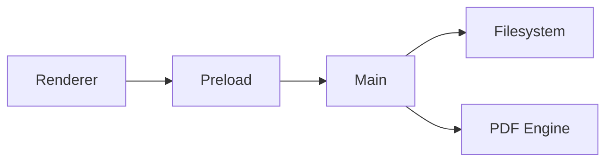

# Integraciones

[Volver al index](../index.md)

## IPC y filesystem

- `workspace:select`
- `workspace:tree`
- `workspace:file:read`
- `workspace:file:write`
- `export:pdf`

## Seguridad

- `contextIsolation: true`
- `nodeIntegration: false`
- validacion de rutas dentro de workspace

## Enlaces y recursos

- [Ir al quickstart](../notes/quickstart.md)
- [Ir a checklist](../operations/checklist.md)
- [Ir a anchor de persistencia](./system.md#persistencia-de-workspace)

### Mermaid de integracion

