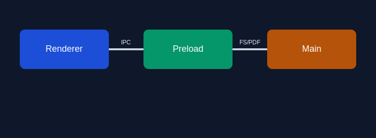
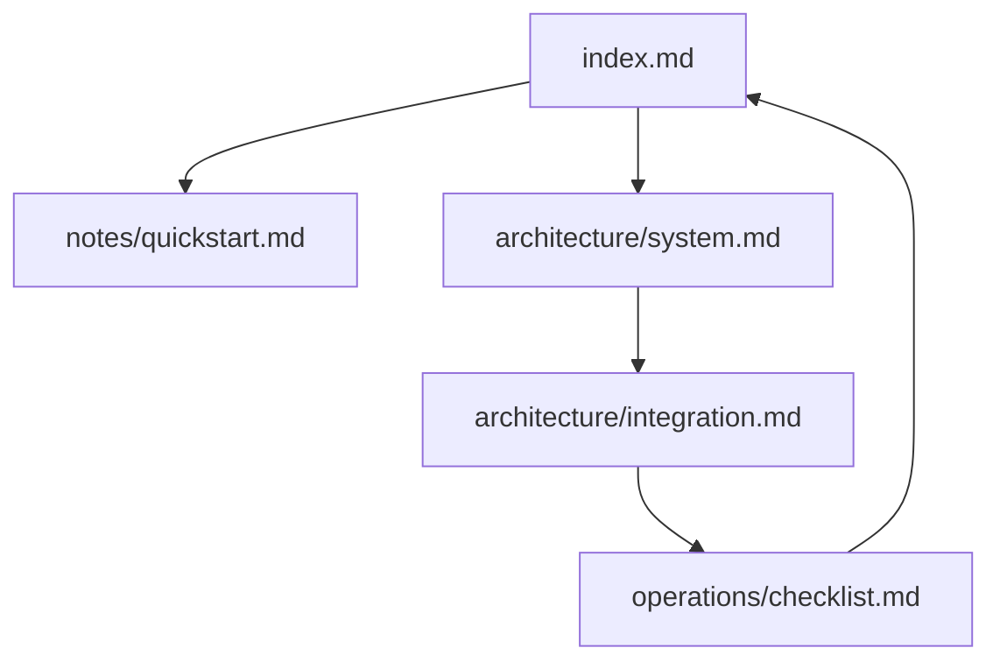

# Proyecto Demo de Exportacion

Este proyecto de prueba valida exportacion PDF con:

- enlaces entre documentos y anchors
- imagenes locales y remotas
- Mermaid
- diagramas de texto (ASCII)

## Navegacion principal 2

- [Quickstart](./notes/quickstart.md)
- [Arquitectura del sistema](./architecture/system.md)
- [Integraciones](./architecture/integration.md)
- [Checklist operativa](./operations/checklist.md)

## Anchors internos

- [Ir a Mermaid principal](#mermaid-principal)
- [Ir a diagrama ASCII](#diagrama-ascii)

## Imagen local



## Imagen remota (internet)


## Mermaid principal



## Diagrama ASCII

```text
+-------------------+        +------------------+
| Workspace Raiz    | -----> | index.md         |
| docs/export-...   |        | punto de entrada |
+-------------------+        +------------------+
           |                          |
           v                          v
  +----------------+          +-------------------+
  | architecture/  |          | notes/            |
  | system.md      |          | quickstart.md     |
  +----------------+          +-------------------+
```

## Referencias cruzadas

- Desde aqui a [Integraciones#enlaces-y-recursos](./architecture/integration.md#enlaces-y-recursos)
- Desde aqui a [Checklist#anchors-cruzados](./operations/checklist.md#anchors-cruzados)
