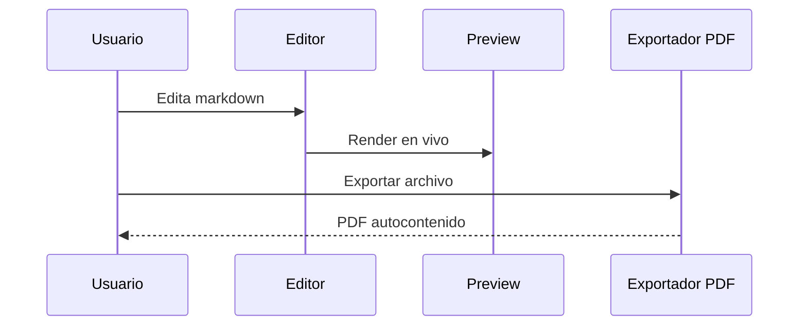
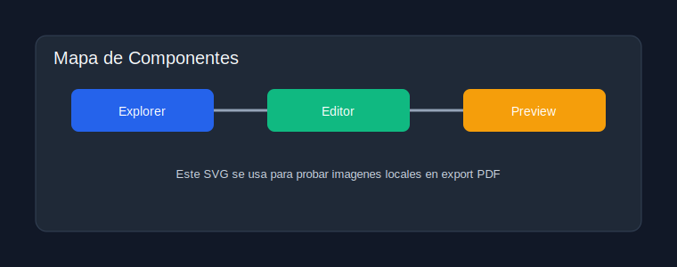

# Quickstart

[Volver al index](../index.md)

## Objetivo

Este documento simula una guia corta con enlaces y contenido mixto.

## Enlaces a otros documentos

- [Arquitectura del sistema](../architecture/system.md)
- [Integraciones](../architecture/integration.md)
- [Checklist operativa](../operations/checklist.md)

## Anchor interno

- [Ir a bloque Mermaid local](#flujo-de-edicion)

## Flujo de edicion

## Imagen local desde carpeta hermana

